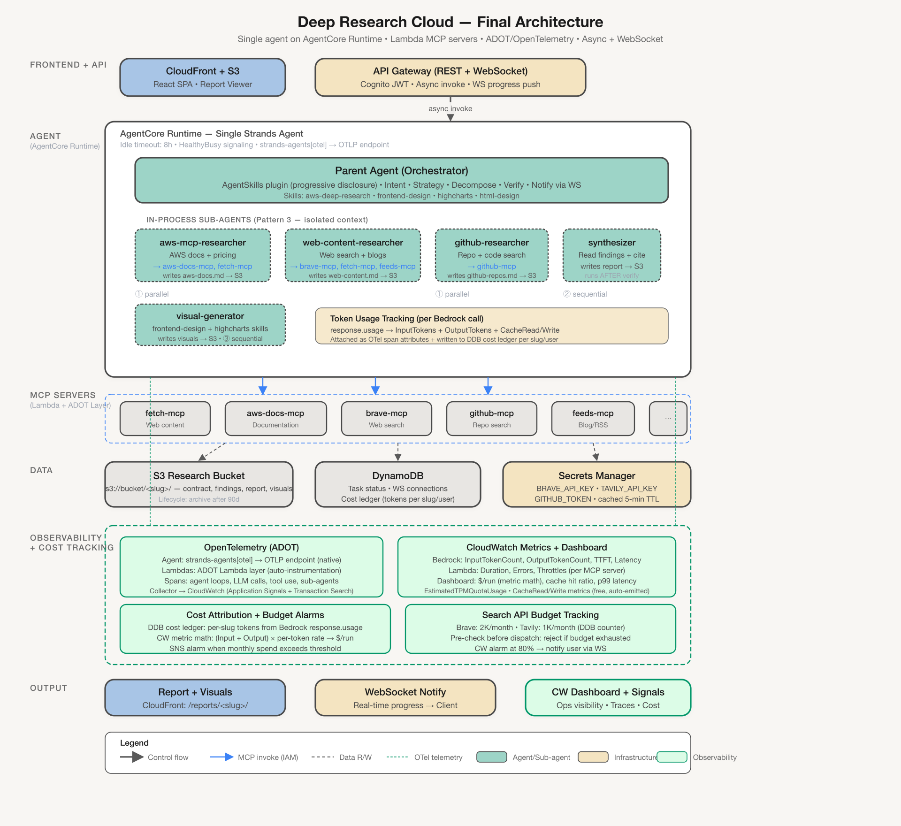

# Deep Research Cloud — Architecture Design

> Serverless research pipeline that migrates the local `aws-deep-research` skill
> to a fully cloud-native deployment on AWS.



## Design Principles

1. **Minimal moving parts** — one agent Lambda, one MCP Runtime, shared data layer
2. **Progressive disclosure** — skills loaded on-demand via Strands `AgentSkills` plugin
3. **Context isolation** — in-process sub-agents (Pattern 3) keep raw content out of parent context
4. **Secrets Manager for all API keys** — never env vars, never hardcoded
5. **$0 idle cost** — Lambda scales to zero; Runtime sessions terminate after 15 min idle
6. **Observable** — CloudWatch, X-Ray, DynamoDB tracking

## Architecture Overview

```
User → CloudFront (React SPA)
         → API Gateway (REST + WebSocket)
           → Lambda Authorizer (Cognito JWT)
           → POST /research → Pre-processing Lambda (1-2 LLM calls, ~15-30s)
               • Intent, strategy, decompose, slug, contract
               • Writes research-contract.md → S3
               • Simple query → invokes Agent Lambda directly (async)
               • Complex query → returns decomposition + contract to client for approval
           → POST /research/{slug}/start → Agent Lambda (Strands Agent, 3-7 min)
               • Loads aws-deep-research skill via AgentSkills plugin
               • Spawns sub-agents (Pattern 3) for context isolation
               • Connects to MCP server on AgentCore Runtime
               • Writes findings/report to S3
               • Pushes progress via WebSocket
           → AgentCore Runtime: research-mcp-server
               • Single FastMCP server hosting the 4 custom tools we own:
                 fetch_url, brave_search, tavily_search, extract_feed
               • Embeds `uvx` to spawn upstream awslabs.* MCP servers as
                 stdio subprocesses (aws-pricing, agentcore-docs, github)
               • AWS docs route directly to the remote AWS Knowledge MCP
                 endpoint (no Runtime hop) over Streamable HTTP
               • Reads API keys from Secrets Manager
           → S3 (artifacts) + DynamoDB (tracking) + Secrets Manager (keys)
```

## Component Summary

| Layer | Service | Purpose |
|-------|---------|---------|
| Frontend | CloudFront + S3 | React SPA — query submission, contract review, progress view, report viewer |
| API | API Gateway (REST + WS) | Auth (Cognito JWT), routing, real-time WebSocket progress |
| Pre-process | **Lambda** (Strands SDK) | 1–2 LLM calls: intent, strategy, decompose, slug, research contract → S3 |
| Agent | **Lambda** (Strands SDK) | Orchestrates research — dispatch sub-agents, verify, synthesize, generate visuals |
| MCP Tools | **AgentCore Runtime** (FastMCP) | Hosts 4 custom tools (fetch, brave, tavily, feeds) and embeds `uvx` to spawn upstream awslabs.* MCP servers (pricing, agentcore, github) as subprocesses; AWS docs route directly to the remote AWS Knowledge MCP at `https://knowledge-mcp.global.api.aws` |
| Skills | Packaged with both Lambdas | `aws-deep-research` + `frontend-design` — loaded via progressive disclosure |
| Data | S3 | Research artifacts: `s3://bucket/<slug>/` — contract, findings, report, visuals |
| Data | DynamoDB | Task tracking, API budget per user, WebSocket connection IDs |
| Secrets | Secrets Manager | `BRAVE_API_KEY`, `TAVILY_API_KEY`, `GITHUB_TOKEN` |

## Key Design Decisions

### Why Two Lambdas (Pre-processing + Agent)

The research lifecycle has a natural break point: after query decomposition and
research contract creation (1–2 LLM calls, ~15–30 seconds), the user may need
to review and approve the contract before expensive research begins.

**Pre-processing Lambda** (`POST /research`):
- 1–2 LLM calls: intent → strategy → decompose → slug → contract
- Writes `research-contract.md` → S3
- For **simple queries** (1–2 entities): invokes Agent Lambda directly (async)
- For **complex queries** (3+ entities): returns decomposition + contract to client
  for approval; no Lambda sits idle waiting — the client holds state

**Agent Lambda** (`POST /research/{slug}/start`):
- Reads approved contract from S3
- Loads `aws-deep-research` skill, dispatches sub-agents, verifies, synthesizes
- Gets the full 15-minute timeout budget for research (no time wasted on approval wait)

Both Lambdas give us:
- **$0 idle cost** — no traffic, no charge
- **Native Step Functions–free orchestration** — the agent IS the orchestrator
- **Simple deployment** — SAM/CDK, no container image management
- **IAM-only auth** to call MCP server on Runtime (SigV4)
- **Failure isolation** — bad decomposition fails fast without wasting research budget

### Why AgentCore Runtime for MCP Servers (not Lambda)

The Agent Lambda needs a single, stable MCP endpoint that bundles every
tool sub-agents will reach for. AgentCore Runtime provides:

- **Session isolation** — each research run gets its own microVM; tools
  share cached state (API keys, MCP subprocess handles, intermediate
  results) within a session
- **No cold starts within a session** — first call spins up the microVM,
  subsequent tool calls in the same session hit a warm process and warm
  `uvx`-spawned MCP subprocesses
- **Up to 8 hours session lifetime** — no timeout pressure for complex research
- **Native MCP Streamable HTTP** — standard transport at `0.0.0.0:8000/mcp`;
  Strands SDK's `MCPClient` connects without any adapter
- **Single deployment** — one Runtime container, one FastMCP server

#### Tool inventory — only what we genuinely own

The local `aws-deep-research` skill's "MCP servers" are mostly thin
clients that spawn upstream `awslabs.*-mcp-server@latest` packages via
`uvx`/stdio, or call the remote **AWS Knowledge MCP** server at
`https://knowledge-mcp.global.api.aws` (GA, Streamable HTTP, rate-limited
but unauthenticated). We do NOT
reimplement any of those — we wrap them.

| Tool | Source | How the FastMCP server exposes it |
|---|---|---|
| `fetch_url` | **custom** (our code) | `@mcp.tool()` directly |
| `brave_search` | **custom** REST wrapper | `@mcp.tool()` directly |
| `tavily_search` | **custom** REST wrapper | `@mcp.tool()` directly |
| `extract_feed` | **custom** RSS/Atom parser | `@mcp.tool()` directly |
| `search_documentation` / `read_documentation` / `recommend` / `list_regions` / `get_regional_availability` / `retrieve_skill` | upstream **AWS Knowledge MCP** (remote, GA) | forwarded to `https://knowledge-mcp.global.api.aws` over Streamable HTTP — no local code, no auth needed |
| `aws_pricing` | upstream `awslabs.aws-pricing-mcp-server@latest` | spawned in-container via `uvx`, exposed as forwarded MCP tools |
| `agentcore_search` | upstream `awslabs.amazon-bedrock-agentcore-mcp-server@latest` | same — `uvx` stdio subprocess |
| `github_search` | upstream `awslabs.git-repo-research-mcp-server@latest` | same — `uvx` stdio subprocess |

This keeps the surface we maintain to four tools (the only ones with
novel logic) and avoids version drift with AWS's authoritative servers.

```python
# research_mcp_server.py
from mcp.server.fastmcp import FastMCP

mcp = FastMCP("research-tools", host="0.0.0.0", stateless_http=True)

# ── Custom tools (we own the implementation) ─────────────────────────
@mcp.tool()
def fetch_url(url: str, max_length: int = 8000) -> str:
    """Fetch and extract readable content from a URL (with SSRF blocklist)."""
    ...

@mcp.tool()
def brave_search(query: str, count: int = 5) -> str:
    """Search the web via Brave Search API."""
    ...

@mcp.tool()
def tavily_search(query: str, depth: str = "basic", max_results: int = 5) -> str:
    """Search the web via Tavily Search API."""
    ...

@mcp.tool()
def extract_feed(feed_url: str, max_entries: int = 10) -> str:
    """Extract entries from an RSS/Atom blog feed."""
    ...

# ── Upstream MCP servers wired via subprocess / HTTP forwarding ──────
# At startup, spawn `uvx awslabs.aws-pricing-mcp-server@latest`,
# `uvx awslabs.amazon-bedrock-agentcore-mcp-server@latest`, and
# `uvx awslabs.git-repo-research-mcp-server@latest` as long-lived stdio
# children, then forward their `tools/list` and `tools/call` traffic.
# The AWS Knowledge MCP is a remote HTTPS server (GA) at
# `https://knowledge-mcp.global.api.aws`; forwarded over MCP Streamable
# HTTP. No authentication needed (rate-limited only).

if __name__ == "__main__":
    mcp.run(transport="streamable-http")
```

> **Why this matters operationally:** any time AWS ships a new pricing
> dimension, AgentCore feature, or git-repo-research capability,
> upgrading the FastMCP container's `awslabs.*` versions is enough —
> no Python work in this repo. Likewise, `https://knowledge-mcp.global.api.aws`
> picks up new AWS docs the moment AWS publishes them.

### Why AgentSkills Plugin (not prompt stuffing)

Skills use progressive disclosure — only metadata (~100 tokens per skill) is injected
into the system prompt at startup. Full instructions load on-demand when the agent
activates a skill via tool call. Resource files (references, scripts, assets) load
individually as needed. This keeps context lean and prevents exceeding the model's
context window.

```python
# Pre-processing Lambda — lightweight, fast
from strands import Agent, AgentSkills
plugin = AgentSkills(skills="/var/task/skills/")

agent = Agent(
    model=model,
    plugins=[plugin],
    tools=[s3_write],  # only needs to write contract to S3
)

# Agent Lambda — full research orchestration
from strands import Agent, AgentSkills
plugin = AgentSkills(skills="/var/task/skills/")

agent = Agent(
    model=model,
    plugins=[plugin],
    tools=[file_read, shell, mcp_tools, s3_read, s3_write, notify_ws],
)
```

Skills packaged with both Lambda artifacts:
```
lambda-package/
├── handler.py
├── skills/
│   ├── aws-deep-research/     # Main research skill
│   │   ├── SKILL.md
│   │   ├── agents/            # Sub-agent definitions
│   │   └── references/        # Intent patterns, blog categories, etc.
│   ├── frontend-design/       # Visual generation skill
│   │   └── SKILL.md
│   └── highcharts/            # Chart reference skill (optional)
│       ├── SKILL.md
│       └── references/
└── requirements.txt
```

### Context Isolation via Sub-Agents (Pattern 3)

The local skill's architecture rule — *"raw content NEVER enters the parent's context"* —
is preserved using Strands SDK's Meta-Tool pattern. Each researcher runs as an isolated
sub-agent within the same Lambda process:

```
Parent Agent (lean context ~4K tokens)
  ├── sub-agent: aws-mcp-researcher     → calls MCP tools, writes aws-docs.md to S3
  │                                       returns: "completed, 3 sources, 4.2KB written"
  ├── sub-agent: web-content-researcher → calls MCP tools, writes web-content.md to S3
  │                                       returns: "completed, 5 sources, 6.1KB written"
  ├── sub-agent: github-researcher      → calls MCP tools, writes github-repos.md to S3
  │                                       returns: "completed, 2 repos found, 2.8KB written"
  ├── verify: check S3 file sizes (direct boto3 call)
  ├── sub-agent: synthesizer            → reads all findings from S3, writes report to S3
  │                                       returns: "report written, 12KB, 47 citations"
  └── sub-agent: visual-generator       → reads report, uses frontend-design skill
                                          returns: "visuals written to s3://.../visuals/"
```

Each sub-agent gets its own context window. Raw web pages, documentation text, and search
results stay in the sub-agent's context and are discarded when it completes. The parent
only receives concise summaries.

## Data Flow

```
1. User submits query via React SPA

2. POST /research → Pre-processing Lambda:
   a. Activates aws-deep-research skill (progressive disclosure)
   b. Classifies intent + strategy (Steps 1–3 of the skill)
   c. Generates slug, writes research-contract.md → S3
   d. Creates DynamoDB tracking record (slug, status: "planned", user, timestamp)
   e. Simple query (1–2 entities):
      → Invokes Agent Lambda asynchronously
      → Returns { slug, status: "started", decomposition } to client
   f. Complex query (3+ entities):
      → Returns { slug, status: "pending_approval", decomposition, contract } to client
      → Client displays contract for user review

3. (Complex only) User reviews, optionally modifies contract, approves:
   → Client PUTs updated contract to S3 (if modified)
   → POST /research/{slug}/start → invokes Agent Lambda

4. Agent Lambda (3–7 min):
   a. Reads approved contract from S3
   b. Connects WS, pushes: "research started, N subqueries across M sources"
   c. Spawns 2–3 researcher sub-agents in parallel (Pattern 3)
      - Each sub-agent connects to research-mcp-server on AgentCore Runtime
      - Each sub-agent calls relevant MCP tools (fetch, search, etc.)
      - Each sub-agent writes findings → S3
   d. Verifies findings (checks S3 file sizes)
   e. Pushes WS update: "findings verified, synthesizing..."
   f. Spawns synthesizer sub-agent → reads S3 findings, writes report → S3
   g. Spawns visual-generator sub-agent → reads report, generates HTML → S3
   h. Pushes WS update: "complete" with report URL
   i. Updates DynamoDB: status → "complete"

5. CloudFront serves report at /reports/<slug>/
```

## WebSocket Progress

The Agent Lambda pushes real-time updates to the client via API Gateway Management API.
Any Lambda with the WebSocket endpoint URL and connection ID can push messages:

```python
apigw = boto3.client('apigatewaymanagementapi', endpoint_url=ws_endpoint)
apigw.post_to_connection(
    ConnectionId=connection_id,
    Data=json.dumps({"type": "progress", "step": "researching", "detail": "..."})
)
```

Progress events: `started` → `decomposed` → `researching` → `verified` → `synthesizing`
→ `generating_visuals` → `complete`

## Cost Model (Per Research Run)

| Component | Estimated Cost |
|-----------|---------------|
| Lambda pre-processing (~30s, 512MB) | ~$0.0004 |
| Lambda agent (~5 min, 1024MB) | ~$0.005 |
| AgentCore Runtime session (~15 tool calls) | ~$0.01–0.03 |
| Bedrock model tokens (Claude Sonnet) | $0.15–0.80 |
| S3 reads/writes | < $0.001 |
| DynamoDB | < $0.001 |
| **Total per run** | **$0.17–0.84** |
| **Monthly idle cost** | **$0.00** |

## Component Inventory

| Component | Count | Type |
|-----------|-------|------|
| Lambda functions | 5 | Pre-processing, Agent, WS $connect, WS $disconnect, Lambda Authorizer |
| AgentCore Runtime | 1 | research-mcp-server (4 custom tools + 3 forwarded `awslabs.*` MCP subprocesses + AWS Knowledge MCP HTTPS forwarder) |
| S3 buckets | 2 | Research artifacts, Static site (CloudFront) |
| DynamoDB tables | 1 | research-tracking |
| Secrets Manager secrets | 3 | BRAVE_API_KEY, TAVILY_API_KEY, GITHUB_TOKEN |
| API Gateway | 1 | REST + WebSocket (same API) |
| CloudFront distribution | 1 | Static site + report serving |
| Cognito User Pool | 1 | Authentication |

## Mapping: Local Skill → Cloud

| Local (pi/Kiro) | Cloud |
|---|---|
| Parent agent context | Lambda agent context |
| `subagent dispatch` (harness) | Strands Pattern 3 (Meta-Tool sub-agents) |
| `$SKILL_DIR/scripts/{brave,tavily,trafilatura,sitemap_feed_extractor}.py` (custom REST/parse) | Custom `@mcp.tool()` functions in the Runtime FastMCP server |
| `$SKILL_DIR/scripts/{aws_doc,aws_pricing,agentcore,github}_search.py` (thin clients spawning `uvx awslabs.*-mcp-server@latest`) | Same upstream servers, spawned by the Runtime container via `uvx` and forwarded through FastMCP — no reimplementation |
| `mcp-proxy-for-aws` → AWS Knowledge MCP (remote HTTPS) | Same upstream service at `https://knowledge-mcp.global.api.aws`, forwarded by the Runtime over MCP Streamable HTTP (no SigV4 — the GA endpoint is unauthenticated) |
| `fetchv2` MCP server (local process) | `fetch_url` tool in Runtime |
| `$WORK_DIR/<slug>/` on disk | `s3://bucket/<slug>/` |
| `.env` file with API keys | Secrets Manager |
| Terminal output | WebSocket push to React SPA |
| Skill references (on-disk reads) | Packaged in Lambda, read via `file_read` tool |

## Research Pipeline Conventions

These conventions are carried over from the local skill **without modification**.
The cloud architecture MUST preserve them exactly — they ensure reproducibility,
auditability, and consistent artifact naming across local and cloud runs.

### Slug Naming (Step 2 of the skill)

The slug identifies the research session on disk (locally) or in S3 (cloud).
It names the work directory and the final report file.

| Rule | Detail |
|------|--------|
| Length | 4–7 hyphen-separated words, 30–60 characters total |
| Format | Lowercase letters, digits, hyphens only (kebab-case) |
| Content | Must encode: primary service(s) + intent verb/dimension + scope qualifier |
| Banned | No generic stopwords alone (`aws`, `guide`, `info`, `research`, `report`) |

**Examples:**

| Query | ❌ Too terse | ✅ Good slug |
|-------|-------------|-------------|
| How does DynamoDB handle hot partitions? | `dynamodb` | `dynamodb-hot-partitions-troubleshooting-patterns` |
| Compare Bedrock vs Azure OpenAI for RAG | `bedrock-azure` | `bedrock-vs-azure-openai-enterprise-rag-comparison` |
| Bedrock AgentCore overview | `agentcore` | `bedrock-agentcore-service-overview-capabilities` |

**Validation before proceeding:**
```bash
token_count=$(echo "$slug" | tr '-' '\n' | wc -l)
char_count=${#slug}
# Reject if token_count < 4 or > 7, or char_count < 30 or > 60
```

**Cloud path:** `s3://research-bucket/<slug>/`

### Query Decomposition (Step 3)

Before dispatching sub-agents, the parent agent decomposes the query into
2–3 subqueries per source using three strategies:

1. **Faceted** — split by dimensions (features, pricing, limits, architecture)
2. **Specificity** — broad + narrow variants of the same question
3. **Synonyms** — alternate terminology for the same concept

Each subquery is labeled with its facet name. The decomposition MUST be
printed to the user (via WebSocket in cloud) before any API calls are made:

```
Dispatching web-content-researcher with:
  [1] "DynamoDB hot partition detection strategies"   (facet: troubleshooting)
  [2] "DynamoDB adaptive capacity auto-splitting"     (facet: mechanism)
```

This transparency rule is non-negotiable — it lets the user correct a bad
decomposition before API credits are spent.

### Research Contract (Step 1g)

The research contract is a lightweight artifact that captures hard facts,
entity constraints, and version requirements. It is written to
`s3://research-bucket/<slug>/research-contract.md` before any research begins.

**Format:**
```markdown
# Research Contract

## Entity Constraints
- **Include**: [specific services, models, versions to research]
- **Exclude**: [older versions, competing services, out-of-scope topics]

## Temporal Constraints
- [Time period, recency requirements, "current pricing only", etc.]

## Factual Anchors
- [Key facts that must be verified before inclusion]
- [Version-specific requirements for data points]

## Labeling Rules
- Data matching constraints → include as-is
- Data for older/different versions → tag with ⚠️ and label actual version
- Data with no version attribution → tag with "⚠️ version unspecified"
```

**When to ask the user to validate:**
- **Complex** (3+ entities, version constraints) → show contract via WS, wait for confirmation
- **Simple** (1–2 entities) → proceed silently

**How it flows through the pipeline:**
1. Parent writes contract → S3
2. Every sub-agent reads `research-contract.md` as its FIRST action
3. Researchers tag data that doesn't match entity/version constraints
4. Synthesizer cross-validates every claim against the contract
5. Mismatched data gets explicit ⚠️ labels in the final report

### Subagent Task-Input Contract

Every sub-agent dispatched by the parent MUST receive these fields:

| Field | Cloud Equivalent | Example |
|-------|-----------------|--------|
| `SKILL_DIR` | Lambda `/var/task/skills/aws-deep-research/` | Skill root with references/ and agents/ |
| `work-dir` | `s3://research-bucket/<slug>/` | Where findings files live |
| `research-contract` | `s3://research-bucket/<slug>/research-contract.md` | First thing each sub-agent reads |
| `original-query` | Passed from API request | Verbatim user question |
| `query-type` | `aws` or `generic` | Shapes search depth |
| `subqueries` | Facet-labeled strings | `[("query", "facet-name"), ...]` |
| `findings-file` | `s3://research-bucket/<slug>/aws-docs.md` | Where sub-agent writes output |

### Findings File Naming

| Sub-Agent | Findings File | S3 Key |
|-----------|--------------|--------|
| aws-mcp-researcher | `aws-docs.md` (+ `aws-pricing.md`) | `<slug>/aws-docs.md` |
| web-content-researcher | `web-content.md` | `<slug>/web-content.md` |
| github-researcher | `github-repos.md` | `<slug>/github-repos.md` |
| synthesizer | `<slug>-report.md` | `<slug>/<slug>-report.md` |
| visual-generator | `visuals/index.html` | `<slug>/visuals/index.html` |

### Findings Verification (Step 5)

After each round of sub-agents completes, the parent verifies findings:

```python
for key in expected_findings_keys:
    obj = s3.head_object(Bucket=bucket, Key=f"{slug}/{key}")
    size = obj['ContentLength']
    if size < 500:
        status = "WEAK"   # flag for synthesizer
    else:
        status = "OK"
```

- `< 500 bytes` → treat as silent failure; passed to synthesizer as `WEAK`
- `MISSING` → file doesn't exist; recorded in report's Gaps & Limitations
- Parent NEVER reads findings file content — only checks size and existence

### Final Report Naming & Delivery

| Artifact | S3 Key | Served At |
|----------|--------|-----------|
| Report | `<slug>/<slug>-report.md` | `/reports/<slug>/report.md` |
| Visuals | `<slug>/visuals/index.html` | `/reports/<slug>/visuals/` |
| Contract | `<slug>/research-contract.md` | (internal, not served) |
| Raw findings | `<slug>/*.md` | (internal, not served) |

CloudFront serves the report directory at `/reports/<slug>/`. The final
WebSocket notification includes the report URL:
```json
{
  "type": "complete",
  "slug": "bedrock-vs-azure-openai-enterprise-rag-comparison",
  "reportUrl": "/reports/bedrock-vs-azure-openai-enterprise-rag-comparison/",
  "reportSize": 12480,
  "citations": 47
}
```

## Files

- `architecture.svg` — Source diagram (editable)
- `architecture.png` — Rendered diagram (1920px retina)
